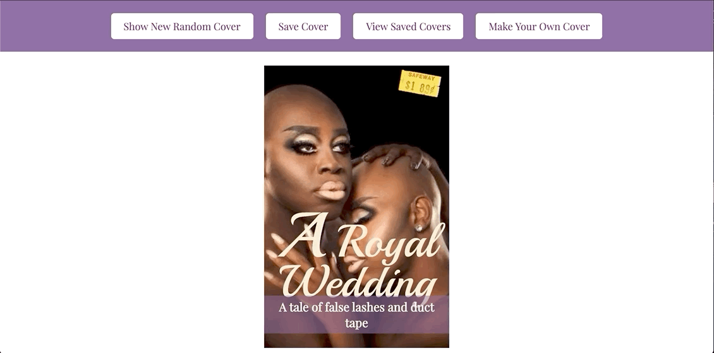
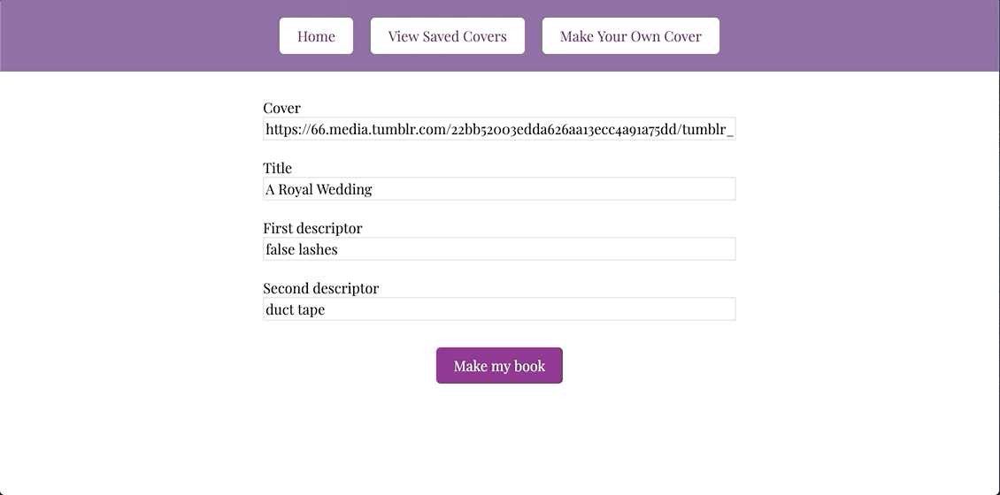

# 2005 FE Mod 1- Romance Novel Generator (Partner Project)

## Project & Goals
### Project description
This project represents the collaborative efforts of Taryn Martin and Jake West. This is our first paired project in Mod 1 of the Turing Front End Program (Cohort 2005). We were tasked with building an app that generates romance novel covers, populated by a random cover image, title, and two subtitle descriptors. We were given a existing codebase for CSS styling elements & HTML elements to manipulate, as well as data arrays to reference & a constructor element to create objects. We were responsible for using JavaScript to build out further functionality. This project was broken into multiple iterations, each with unique requirements (described below). The functionality we successfully built includes:
  1. random cover generator
  2. button functionality to switch views
  3. form functionality so users can create custom covers
  4. button functionality so users can save current cover
  5. ability to display all saved covers
  6. automatically prevent duplicate covers from being saved

### Learning Goals
* Deepen our understanding of JavaScript syntax & logic
* Learn how JavaScript interacts with CSS & HTML code, as well as DOM elements
* Minimize external research & rely on skills we've built
* Comprehension > production
* Strengthen our skills as collaborators on a project

## Project Status
Currently in development: working to refactor code & simplify variable names; future functionality includes ability to delete a saved cover upon mouse click.

## Project Screenshots
1. Random cover generator - on reload of page

2. Random cover generator - on click

3. Button to go to saved covers view

4. Button to go to make your own cover view

5. Shows moving between home, saved covers, and make your own cover view

6. Shows user creating their own cover

7. Shows user saving a cover 

## Reflection
Taryn Personal: This project was very eye opening for me. I was expecting to be able to take more of the stuff I learned from lessons and homework and apply it directly to what we needed to do. We ended up needing to do a lot more research and experimentation to achieve the end results called for in the project specs. I think that overall this was a very valuable experience on many fronts. I got more direct experience in what it will be like to work on a software project and how frustration can be a huge part of the process. I’ve learned more about what it’s like to work with a partner, both in person and remotely. I also learned a lot of directly applicable skills, such as more experience with git and GitHub. I also feel I have gained a better understanding of the role Javascript plays in website development, and how JS, CSS, HTML, data models, and the DOM all interact and use each other. Overall, I found this project to be incredibly helpful for furthering my knowledge and understanding of software development, especially coming into this program with no knowledge or experience.

Jake Personal: The Romance Novel Generator project was an exciting, albeit frustrating, chance to reflect on how much I've learned at Turing in the past few weeks. Initially, I started this project apprehensive about partner work & skeptical of ability to contribute because I often feel overwhelmed by the material. I also felt unsure about how/when/to whom to reach out for help. Along the way, there was a lot of celebrating achievements, immense learning, and ample struggle. In the end, I'm proud of our final product! No, we did not get EVERY piece of functionality- and that's okay- because Taryn and I collaborated and grew together. My biggest growth moment has to be a new-found comfort for asking for help and identifying cohort-mates that I feel really comfortable reaching out to. I look forward to growing these skills in the future!

As we often found throughout this project, our unique perspectives complement each other well! Both of our personal reflections speak to the other person's experience. This was a great growth moment for both of us & we both feel more confident moving along our journey to becoming software developers!

## Links
+ Deployed Site: https://jkwest-93.github.io/romcom/
+ Taryn Martin GitHub: https://github.com/bjjdestroyer
+ Jake West GitHub: https://github.com/jkwest-93/
